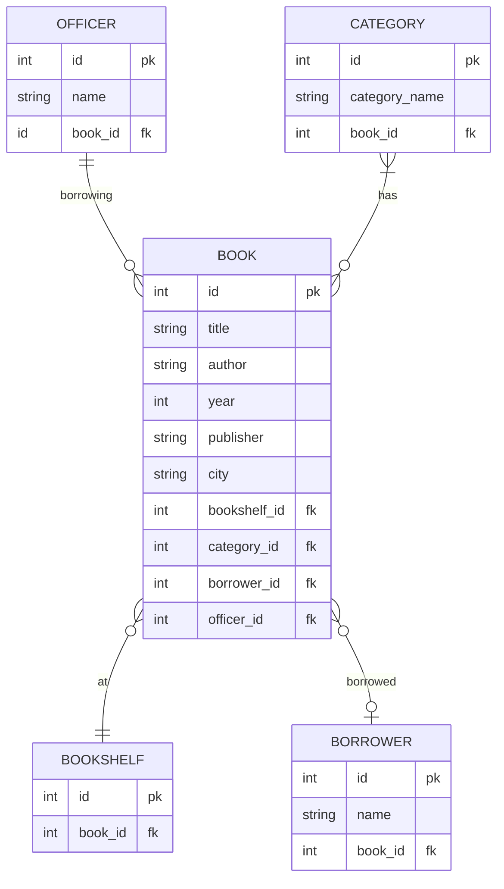

```mermaid
    erDiagram
        BOOK }o--|| BOOKSHELF : at
        BOOK }o--o| BORROWER : borrowed
        BOOK {
            int id pk
            string title
            string author
            int year
            string publisher
            string city
            int bookshelf_id fk
            int category_id fk
            int borrower_id fk
            int officer_id fk
        }


        BOOKSHELF {
            int id pk
            int book_id fk
        }

        OFFICER ||--o{ BOOK : borrowing
        OFFICER {
            int id pk
            string name
            id book_id fk
        }

        BORROWER {
            int id pk
            string name
            int book_id fk
        }

        CATEGORY }|--o{ BOOK : has
        CATEGORY {
            int id pk
            string category_name
            int book_id fk
        }
```