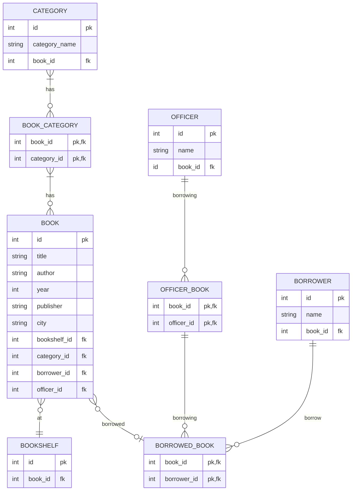

```mermaid
    erDiagram
        BOOK }o--|| BOOKSHELF : at
        BOOK {
            int id pk
            string title
            string author
            int year
            string publisher
            string city
            int bookshelf_id fk
            int category_id fk
            int borrower_id fk
            int officer_id fk
        }


        BOOK }o--o| BORROWED_BOOK : borrowed
        BORROWED_BOOK {
            int book_id pk, fk
            int borrower_id pk, fk
        }

        OFFICER_BOOK ||--o{ BORROWED_BOOK : borrowing
        OFFICER_BOOK {
            int book_id pk, fk
            int officer_id pk, fk
        }

        BOOKSHELF {
            int id pk
            int book_id fk
        }

        OFFICER ||--o{ OFFICER_BOOK : borrowing
        OFFICER {
            int id pk
            string name
            id book_id fk
        }

        BORROWER ||--o{ BORROWED_BOOK : borrow
        BORROWER {
            int id pk
            string name
            int book_id fk
        }

        CATEGORY }|--o{ BOOK_CATEGORY : has
        CATEGORY {
            int id pk
            string category_name
            int book_id fk
        }

        BOOK_CATEGORY }|--o{ BOOK : has
        BOOK_CATEGORY {
            int book_id pk, fk
            int category_id pk, fk
        }
```